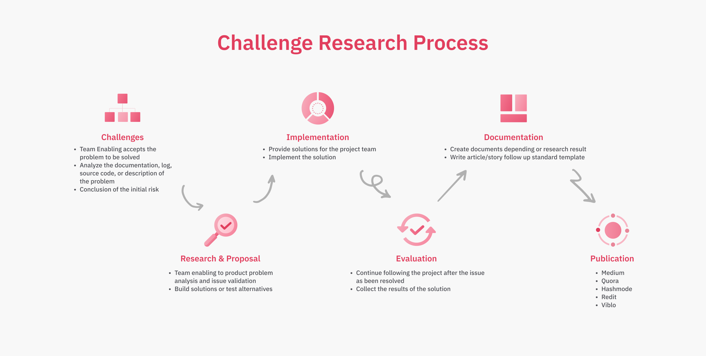

# Introduction

Welcome to the Enabling team! Glad to have you here!

We’ve put together this onboarding plan to help you get up to speed with the group as well as to catch up on what we have done so far. Feel free to reach out in the [discord server](https://discord.gg/dwarvesv) if you have any questions 🚀.

## How to submit a new challenge

### **Problem definition (problem story)**

You can describe your challenge with our template at [Challenge template](./challenge-request.md)

### How to submit new challenge on GitHub

When you are ready with your challenge request you need create a pull request to branch master

**Create PR to branch develop with a format**

- Title: “challenge: challenge title”
- Description: “short challenge description”

## How we work

### Build Challenge team

We organize a problem-solving team that can be from 3-4 members, members are assigned to the positions of Team lead, Project owner.

- Create Epic from the problem definition and define an output
- Sprint planning and grooming
- Setup weekly meetings and review
- Setup retrospective

### **Collect challenge request detail**

- The  R&D team connects with the requester and gets more inside the challenge
- Refine the challenge request and confirm with the requester
- Report all new challenges to the R&D team and review weekly.
- Response to the requester and keep connected with them

### R&D **Change log**

We will create R&D changelog bi-weekly and send out to team with format: [ChangeLog template](./change-log.md)

### Areas of responsibility

| AOR | Direct responsible | Backup | Discord channel|
|---|---|---|---|---|
|Secretary| Ngoc Thanh Pham | Thanh Pham ||
|Backend| Minh Tran | Hieu Vu ||
|Frontend| An Tran | Thanh Pham ||
|DevOps| Quang |||
|Process| Huy Tieu |||
|Blockchain| Ngoc Thanh Pham |||
|Mobile| Trung Phan |||
## Research Process

## How we present a solution report

We can flow the template [Solution Template](./solution-template.md)

## How we publish a report

we use the team's social account to publish the solution and make it viral on the dev community

**List community:**

- Medium
- Hashnode
- Redit
- Quora
- Viblo