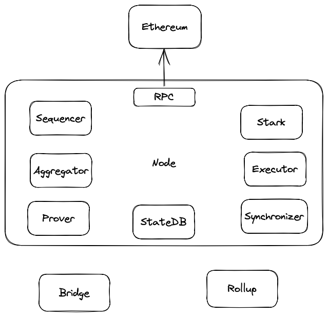
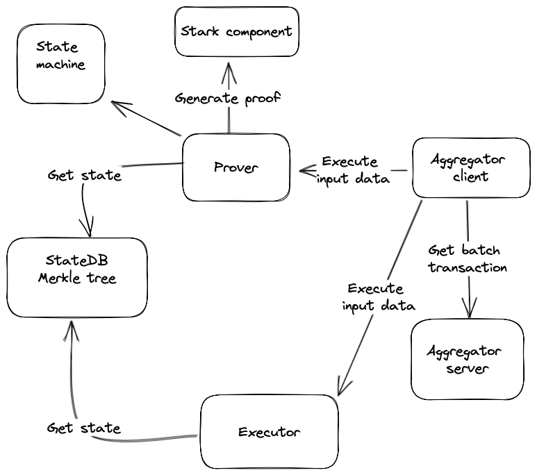
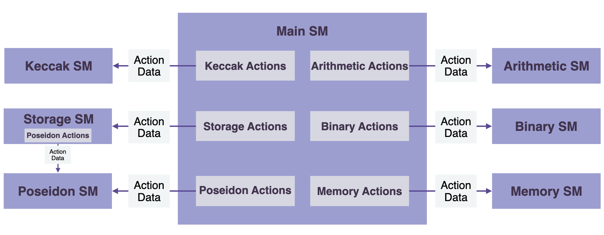
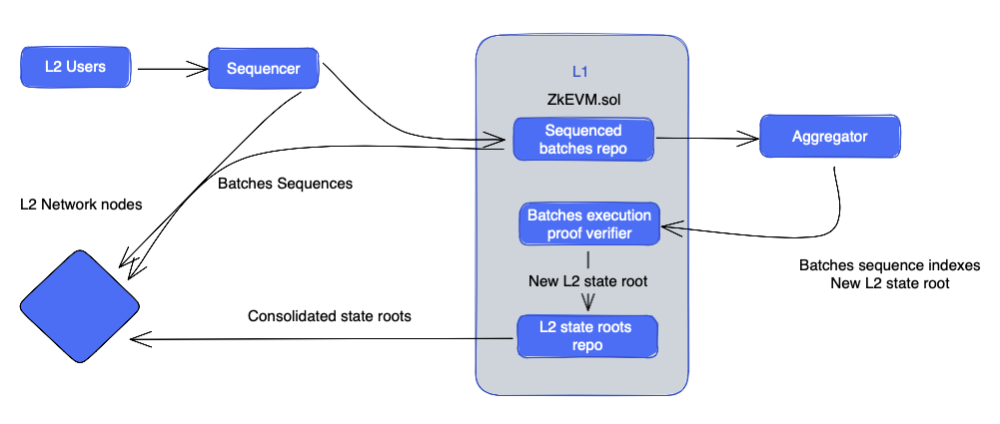
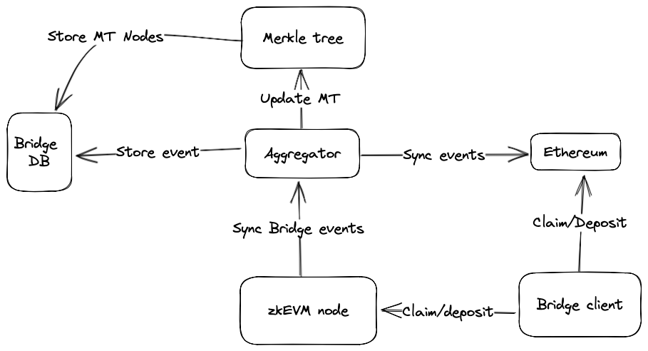
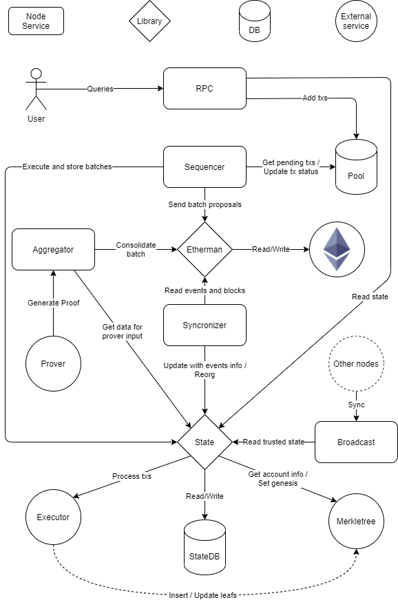

## Introduction

The overall design of zkEVM follows the State Machine model and thus  ** emulates the Ethereum Virtual Machine (EVM)** , with the aim of providing the same user experience as in Ethereum. In addition to enabling ERC20 token payments and transfers, users can now run Ethereum smart contracts on it.

The aggregate strategy is to develop a zkProver that executes a series of multiple transactions, proves their validity, and publishes only the minimum size valid proof for verification. This reduces transaction completion times and saves gas costs for Ethereum users.

However, zkEVM is not just a compilation but a zero-knowledge compilation. Its design utilizes the most famous techniques in ZK folklore, while introducing novel ZK tools. One example of such tools is the new Polynomial Identification Language (PIL), which plays a key role in enabling zkProver to generate verifiable proofs.

State machines are best suited for repetitive deterministic computations, which are common in Ethereum. In contrast, arithmetic circuits will need unrolled loops, and thus lead to undesired larger circuits.


## Definition of success

- Architectural design of a layer 2 blockchain using zkrollup method for transaction verification
- The components of a complete blockchain and the tasks of each component

## Requirement

- Compatible with applications, platforms, technologies ... that are working with the Ethereum network (Block, evm)
- Scalability of computation speed, transaction validation, proof building. The time to create a batch is optimized according to the network throughput of layer 2 (If the number of transactions / second increases, it is necessary to reduce the block time)
- Data availability: data is saved off-chain, proof is saved on-chain, transaction information can be saved via call-data
- Optimizing on-chain storage cost and size through reducing proof size, saving data in call-data
- The system is towards decentralized as many components as possible such as: Sequencer, Prover

## Approach

The general approach to designing zkProver to realize a proof system based on State Machines is as follows:

- Turn the necessary deterministic computation into **state machine computation** .
- Describe state transitions according to **algebraic constraints** . These are like rules that every state transition must meet.
- Use **interpolation** state values to build state machine description polynomials.
- Define **polynomial identity** to which all state values must satisfy.
- A specially designed **cryptographic proof** system (e.g. STARK, SNARK or a combination of both) is used to generate verifiable proof that anyone can Verification.

## Design the system

### System Overview

Similar to other blockchains, the system will include the main components of a regular blockchain. The difference in layer 2 will be that the calculation of the smart contract will be processed off-chain by specialized machines to improve processing speed, the calculation results will be verified by a separate algorithm. and saved on layer 1.

The system will include the following basic components:

- Smart contract
- Sequencer, Prover, Aggregator
- Storage, StateDB
- EVM



### Components

- The system will include the following main components:
    - Node
        - Sequencer
        - Prover
        - RPC
        - Verifier
    - Bridge
    - Storage
    - ZK SNARK/STARK
    - Synchronizer

## Component detail diagram

### ZkProver

The proof and verification of transactions in Polygon zkEVM are both handled by a zero-knowledge proofing component called zkProver. All the rules for a valid transaction are implemented and executed in zkProver. Prover relies on the transactions to be processed, the state of the network to calculate the proof. zkProver mainly interacts with two components i.e. Node and Database (DB). Therefore, before diving deeper into other components, we must understand the control flow between zkProver, Node and Database. Here is a diagram to explain the process clearly.



- Prover executes input data, calculate result state and generate a proof. It calls the Stark component to generate a proof of the Executor state machine commited polynomials.
- Key components of zkProver for generating verifiable proof:
    - Executor is the main state machine executor
    - STARK recursive component
    - CIRCOM library
    - Prove zk-SNARK

### State machine



[*https://docs.hermez.io/zkEVM/zkProver/State-Machines/Overview/figures/fig-actions-sec-sm.png*](https://docs.hermez.io/zkEVM/zkProver/State-Machines/Overview/figures/fig-actions-sec-sm.png)

The system uses state machines with transactions with inputs are transactions, old and new state, sequencer’s chainID

- Main state machine executor
- Secondary state machine
    
     (a) Binary SM
    
     (b) Memory SM
    
     (c) Storage SM
    
     (d) Poseidon SM
    
     (e) Keccak SM
    
     (f) Arithmetic SM
    

### Aggregator

The Aggregator client connects to the Aggregator server, and call Prover to generate the proof of the calculation

### Executor

Executors execute input data and calculate result state but not generate proof, provide fast way to check the proposed batch is properly built and fit the amount of work that can be proven in one single batch.

### StateDB

StateDB provide a single source of state, store the state of system and database

### L2 State

Design to update L2 State over time so that the state is always the most properly synchronized over time. There are three stages of L2 State, each of which corresponds to three different ways that L2 nodes can update their state. All three cases depend on the format of the batch data used to update the L2 State.

In the **first case** , the update is only notified by information (i.e. the Lot consisting of sorted transactions) coming directly from the Trusted Sequencer, before any data is available on L1 . The resulting L2 state is called  **Trusted state** .

In the  **second case** , the update is based on the  **information obtained by the L2 nodes from the L1**  network. That is, after the plots have been sequenced and data have been made available on L1. The L2 state is called  **Virtual State**  at this time.

The information used to update L2 State in the **final case** includes verified zero-knowledge proofs of computational integrity. That is, **after the Zero-Knowledge proof has been successfully verified in L1, L2 nodes synchronize their local L2 State root** with the root committed in L1 by the Trusted Aggregate trust. As a result, such L2 State is called  **Unified State** 

### Sequencer

Trusted Sequencer generates batches, but to achieve quick results of L2 transactions and avoid having to wait for the next L1 block, they are shared with L2 network nodes via a streaming channel. Each node will run batches to compute local L2 state results.

Once the Trusted Sequencer has committed the batch chains fetched directly from L1, the L2 network nodes will re-execute them and they will no longer have to trust it.

Execution of off-chain batches will eventually be verified on-chain via Zero-Knowledge proof and the resulting L2 state root will be committed. As the zkEVM protocol evolves, new L2 state roots will be synchronized directly from L1 by the L2 network nodes.



### Bridge diagram

The bridge is responsible for receiving and processing requests to transfer information across different blockchain networks. For example, user wants to send ETH from Ethereum network to layer 2 blockchain, user will send request to smart contract on ethereum or smart contract on layer 2, Aggregator will listen for pre-registered events for processing. You can follow the diagram below:



- Bridge client creates request to deposit or claim to Ethereum or zkEVM node (layer 2) to start transfer token
- The Aggregator will sync events with Ethereum and store bridge events to Bridge DB and update the Merkle tree root
- The zkEVM node sync bridge event with Aggregator

### Smart contract:

The smart contract used to execute the proof of layer 2 in layer 1, transfer asset between layer and store proof and root markle tree

- Smart contract [Bridge.sol](https://github.com/0xPolygonHermez/zkevm-contracts/blob/main/contracts/PolygonZkEVMBridge.sol):
    
    Các hàm chính: 
    
    - bridgeAsset: transfer token from L1 to L2, add leaf to markle tree, emit event
    - bridgeMessage: transfer message in bytes format that executeable
    - claimAssert: verify merkle proof and withdraw tokens/ether
    - claimMessage: Verify merkle proof and execute message
- Smart contract [GlobalExitRoot.sol](https://github.com/0xPolygonHermez/zkevm-contracts/blob/main/contracts/PolygonZkEVMGlobalExitRoot.sol)
    - updateExitRoot: Update the exit root of one of the networks and the global exit root
    - getLastGlobalExitRoot: Return last global exit root
- Smart contract [GlobalExitRootL2.sol](https://github.com/0xPolygonHermez/zkevm-contracts/blob/main/contracts/PolygonZkEVMGlobalExitRootL2.sol)
    - updateExitRoot: Update the exit root of one of the networks and the global exit root
- Smart contract [zkEVM.sol](https://github.com/0xPolygonHermez/zkevm-contracts/blob/main/contracts/PolygonZkEVM.sol)
    - sequenceBatches: Allows a sequencer to send multiple batches
    - verifyBatches: Allows an aggregator to verify multiple batches
    - trustedVerifyBatches: Allows an aggregator to verify multiple batches
    - sequenceForceBatches: Allows anyone to sequence forced Batches if the trusted sequencer do not have done it in the timeout period

### RPC

RPC (Remote Procedure Call) is a JSON-RPC interface compatible with the Ethereum network. In order for a software application to interact with the Ethereum blockchain (by reading blockchain data and/or sending transactions to the network), that application must connect to an Ethereum node. RPC allows the integration of zkEVM with existing tools, such as Metamask, Etherscan, and Infura. It adds transactions to the Pool and interacts with the State using read-only methods. It allows interaction with the blockchain through methods similar to EVM.

### Final Node component diagram

One node will include all the components as we have shown above. the components will be started and run simultaneously as a whole



The diagram represents the main components of the software and how they interact between them. Note that this reflects a single entity running a node, in particular a node that acts as the trusted sequencer. But there are many entities running nodes in the network, and each of these entities can perform different roles. More on this later.

- (JSON) RPC: an interface that allows users (metamask, etherscan, ...) to interact with the node. Fully compatible with Ethereum RPC + some extra endpoints specifics of the network. It interacts with the `state` to get data and process transactions and with the `pool` to store transactions
- Pool: DB that stores transactions by the `RPC` to be selected/discarded by the `sequencer` later on
- Trusted Sequencer: get transactions from the `pool`, check if they are valid by processing them using the `state`, and create sequences. Once transactions are added into the state, they are immediately available to the `broadcast`service. Sequences are sent to L1 using the `etherman`
- Broadcast: API used by the `synchronizer` of nodes that are not the `trusted sequencer` to synchronize the trusted state
- Permissionless Sequencer
- Etherman: abstraction that implements the needed methods to interact with the Ethereum network and the relevant smart contracts.
- Synchronizer: Updates the `state` by fetching data from Ethereum through the `etherman`. If the node is not a `trusted sequencer` it also updates the state with the data fetched from the `broadcast` of the `trusted sequencer`. It also detects and handles reorgs that can happen if the `trusted sequencer` sends different data in the broadcast vs the sequences sent to L1 (trusted vs virtual state)
- State: Responsible for managing the state data (batches, blocks, transactions, ...) that is stored on the `state SB`. It also handles the integration with the `executor` and the `Merkletree` service
- State DB: persistence layer for the state data (except the Merkletree that is handled by the `Merkletree` service)
- Aggregator: consolidates batches by generating ZKPs (Zero Knowledge proofs). To do so it gathers the necessary data that the `prover` needs as input through the `state` and sends a request to it. Once the proof is generated it's sent to Ethereum through the `etherman`
- Prover/Executor: service that generates ZK proofs. Note that this component is not implemented in this repository, and it's treated as a "black box" from the perspective of the node. The prover/executor has two implementations: [JS reference implementation](https://github.com/0xPolygonHermez/zkevm-proverjs) and [C production-ready implementation](https://github.com/0xPolygonHermez/zkevm-prover). Although it's the same software/service, it has two very different purposes:
    - Provide an EVM implementation that allows processing transactions and getting all needed results metadata (state root, receipts, logs, ...)
    - Generate ZKPs
- Merkletree: service that stores the Merkletree, containing all the account information (balances, nonces, smart contract code, and smart contract storage). This component is also not implemented in this repo and is consumed as an external service by the node. The implementation can be found [here](https://github.com/0xPolygonHermez/zkevm-prover)

### Transaction Flow

- **Submit transaction**

Transactions in the zkEVM network are generated in the user's wallet and signed with their private key. Once created and signed, **transactions are sent to the Trusted Sequencer node through their JSON-RPC interface** . The transactions are then stored in the  **pending transaction pool** , where they await the Sorter's selection to execute or discard.

**Transactions and Blocks on zkEVM**

In the current design,  **a single transaction is equivalent to a block**. This design strategy not only improves RPC and P2P communication between nodes, but also enhances compatibility with existing engine and facilitates rapid completion in L2. It also simplifies the process of locating user transactions.

- **Execute transaction**

Trusted **Sequencer reads transactions from pool** and decides whether to **cancel** them or sort**and execute** them. The executed transactions are added to a batch of transactions and the Local L2 State of the Sequencer is updated.

After a transaction is added to the L2 State, it is broadcast to all other zkEVM nodes via the broadcast service. It is worth noting that  ** by relying on Trusted Sequencer, we can reach the final transaction quickly (faster in L1)** . However, the resulting L2 State will remain in a trusted state until the batch is committed in the Consensus Contract.

- B**atch transaction**

Trusted Sequencer must batch execute transactions using the following BatchData structure specified in the PolygonZkEVM.sol contract:

```
struct BatchData {
  bytes transactions;
  bytes32 globalExitRoot;
  uint64 timestamp;
  uint64 minForcedTimestamp;
}
```

- Transactions

These are byte arrays containing concatenated batch transactions.

Each transaction is  ** encrypted in the Ethereum pre-EIP-115 or EIP-115 format using the RLP (Recursive-length prefix)**  standard, but the signature values,  `v`, `r`And `s`, concatenated;

- Batch sequencing

**Plots need to be sequenced and validated** before they can become part of the L2 Virtual State.

Trusted Sequencer has successfully added a batch to a sequence of batches using the  **L1 PolygonZkEVM.sol** contract `sequencedBatches` map, which is essentially a  **a storage structure containing a queue of processes self-defined Virtual State** .

```
// SequenceBatchNum --> SequencedBatchData
mapping(uint64 => SequencedBatchData)public sequencedBatches;
```

The batchs must be part of an array of batchs that are ordered sequentially. The Trusted Sequencer calls Contract PolygonZkEVM.sol , which uses the sequenceBatches mapping, which accepts an ordered array of batches as an argument. Please see the code snippet provided below.

```jsx
function sequenceBatches ( 
    BatchData[] memory batches
) public ifNotEmergencyState onlyTrustedSequencer
```


Minimum and maximum of batch size limita

The contract's public constant,  **MAX TRANSACTIONS BYTE LENGTH** , defines the maximum number of transactions that can be included in a batch (300000).

Similarly, the number of lots in a chain is limited by the contract's public constant **MAX VERIFY BATCHES** (1000). The batch array must contain at least one batch and no more than the value of the constant **MAX VERIFY BATCHES** .

Only Trusted Sequencer Ethereum accounts can access  `sequencedBatches` mapping. It is essential that the contract is not in a state of emergency.

The  **function call will be reverted if the above conditions are not met** .

**Batch Validity & L2 State Integrity**

The  `sequencedBatches` function iterates through each batch of the sequence, checking its validity. A valid lot must meet the following criteria:

- It must include a `globalExitRoot`**GlobalExitRootMap** `PolygonZkEVMGlobalExitRoot.sol`**A lot is valid only if it includes a valid `globalExitRoot`.** value contained in the L1 bridge contract.
- The length of the transaction byte array must be less than the value of **constant MAX_TRANSACTIONS_BYTE_LENGTH**
- The batch timestamp must be greater than or equal to the timestamp of the last batch sequenced, but less than or equal to the timestamp of the block that executed the L1 transaction in the sequence. **All lots must be ordered from time to time**

If a batch is invalid, the transaction reverts, dropping the entire chain. Otherwise, if all batches to be sequenced are valid, sequencing will continue.

A stored variable called  `lastBatchSequenced` is used as a batch counter and so it is incremented each time a batch is sequenced. It provides a batch-specific index number to be used as the position value in the batch sequence.

The same hashing mechanism used in blockchains to link one block to the next is used in batches to ensure the cryptographic integrity of the batch chain. That is, include the aggregate message of the previous batch in the data used to calculate the aggregate message of the next batch.

The message of a given batch is thus  **cumulative hash of all previously sequenced batches** , hence the name  **cumulative hash**  of a batch, expressed equals  `oldAccInputHash` for the old and  `newAccInputHash` for the new.

## Summary

Layer 2 zkevm is a solution to speed up transactions and reduce costs in the Ethereum network. It allows transactions to be processed faster using blocks contained in smart contracts, without having to wait for blocks to be mined.

One of the advantages of layer 2 zkevm is its higher security compared to other traditional blockchain architectures. It uses Zero-Knowledge Proof to verify the validity of transactions without disclosing any information related to those transactions.

The most important components in the system are the Prover and the smart contract, which are responsible for generating proofs and verifying proofs for transactions on the network in each batch, which enhances functionality and scalability. of the blockchain network, while minimizing security risks and increasing the security of the system.

## Referral

- [https://docs.hermez.io/zkEVM/Overview/Overview/#zkprover](https://docs.hermez.io/zkEVM/Overview/Overview/#zkprover)
- [https://medium.com/iosg-ventures/zk-cross-chain-message-protocol-secure-cheap-foundation-of-multichain-dapps-66adc65cedc9](https://medium.com/iosg-ventures/zk-cross-chain-message-protocol-secure-cheap-foundation-of-multichain-dapps-66adc65cedc9)
- [https://academy.binance.com/en/articles/zk-snarks-and-zk-starks-explained](https://academy.binance.com/en/articles/zk-snarks-and-zk-starks-explained)
- [https://en.wikipedia.org/wiki/Zero-knowledge_proof](https://en.wikipedia.org/wiki/Zero-knowledge_proof)