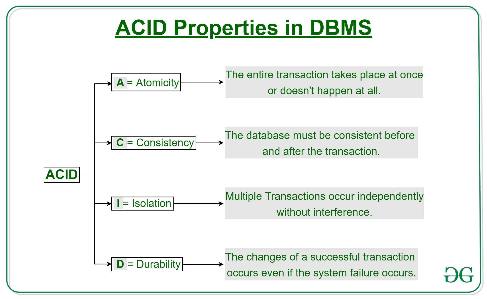

# Database system

## Types
### Relational (SQL Db)
 Data store organizing data into tables that are related to one another, which explains the name. RDBMSs have a predefined schema, meaning data resides in rows (records) and columns (attributes) with a strict structure

#### Scalability
* Vertical scaling: scaling is done by adding more computer (CPU, GPU, and RAM) power to that one server
* Scaling an SQL database between multiple servers (horizontal scaling) can be a challenge as it requires data structure changes and additional engineering efforts.
#### Performance
 * Great performance with intensive read/write operations on small to medium datasets
 * However, when the amount of data and user requests grows, the performance may suffer
#### Security
* Due to the integrated structure and data storage system, SQL databases don’t require much engineering effort to make them well-protected
* ACID (atomicity, consistency, isolation, durability): 

### None relational
 Non-tabular database that uses different data models for storing, managing, and accessing data. The most common data models are: 
  * document-oriented: store, retrieve, and manage data as JSON documents
  * key-value
  * wide-column: tore data in the tabular format with flexible columns

#### Scalability
* Horizontal scaling
#### Performance
* Known for their high-performance 
* Provides a large number of users with simultaneous access
* Can store unlimited sets of data that come in all types and shapes

## Db management systems comparison: 
 

## MySQL
This is one of the most popular relational database systems. Originally an open-source solution.
### Pros
* Free installation: CE edition is most suitable for a fresh start.
* Cloud compatibility
### Cons
* Scalability challenges
* Partial open-source support
* Limited compliance with SQL standards: Need to check
### Use cases
* Small web-based solutions
* OLAP/OLTP systems. This is one of the best use cases for a MySQL database, as OLAP/OLTP don’t require complex queries and large volumes of data. 

## Maria DB
MariaDB, an open-source fork from MySQL, has commercial support, has similar commands, APIs, and libraries as MySQL
### Pros
* Encryption
* Broad functionality: More features: For instance, GIS support suggests smooth coordinate storage and location data queries. Dynamic columns allow a single DBMS to provide both SQL and NoSQL data handling for different needs...
* High performance: better than origin MySQL. E.g: Extensive optimization features improve thread pool management and data processing. 
### Cons
* Still growing community
* Gaps between MySQL and MariaDB update versions
### Use cases
* Quite same with MySQL but with more features and performance

## Oracle
 Support multi data models like document, graph, relational, and key-value within the single database. Focus cloud computing at latest release. Have free version.
### Pros
* Strong tech support and documentation
* Large capacity. Oracle’s multi-model solution allows for accommodating and processing a vast amount of data.
### Cons
* High cost. Professional license costs 17.5k $ for Standard Edition. The Enterprise costs 47.5k $. Now oracle focus on cloud, cloud cost looks like much more flexible and more comparative, they show the comparison with AWS tier.
* Resource-consuming technology. On-premise could require high hardware and software costs.
* Hard learning curve. Oracle database is not a system to start using right away. It’s better to have certified Oracle DB engineers to run it.
### Use cases
* online OLTP, data warehousing, and even mixed (OLTP and DW) database application
* billion records to hold and manage – and sufficient budget to support it

## PostgreSQL
This database management system shares its popularity with MySQL
### Pros
* Great scalability
* Support for custom data types. PostgreSQL natively supports a large number of data types by default, such as JSON, XML, H-Store, and others. Being one of the few relational databases with strong support for NoSQL features.
* Easily-integrated third-party tools. PostgreSQL database management system has the strong support of additional tools, both free and commercial.
* Open-source and community-driven support.
### Cons
* Lack of reporting and auditing instruments.
### Use cases
* Wide use cases due to its flexibility and scalability.

## MSSQL
As a completely commercial tool, Microsoft SQL Server is one of the most popular relational DBMS, in addition to MySQL, PostgreSQL, and Oracle.
### Pros
* Variety of versions. Microsoft SQL Server provides a wide choice of different options with diverse functionalities
* End-to-end business data solution. With a focus on mostly commercial solutions, MSSQL provides a lot of business value-added features. The optional selection of components allows building ETL solutions, forming a knowledge base, and implementing data clearance. Also, it provides tools for overall data administration, online analytical processing, and data mining, reporting...
* Rich documentation and community assistance.
* Cloud database support. can be integrated with Microsoft cloud, Azure SQL Database
### Cons
* High cost
* Unclear and floating license conditions
* Complicated tuning process
### Use cases
* Companies with other Microsoft product subscriptions

## MongoDB
A free, open-source, non-relational DBMS, MongoDB also includes a commercial version. 
### Pros
* NoSQL. Simple data access, storage, input, and retrieval.
* Horizontally scalable solution. 
### Cons
* Extensive memory consumption. The denormalization process, when previously normalized data in a database is grouped to increase performance, usually results in high memory consumption. Beyond that, because there is no support for joins, Mongo databases have data oversupply, resulting in big memory waste and lower application performance.
* Data insecurity. With a focus on fast data operation, lack of data security.
* Complicated process to interpret into other query languages.  As MongoDB wasn’t initially developed to deal with relational data models, the performance may slow down in these cases.
### Use cases
* MongoDB works best in real-time data integration and database scalability

## Redis
An open-source, NoSQL, in-memory data structure store, Redis can also be used as a cache. Instead of documents, it uses key-value pairs
### Pros
* Rapid solution. Due to its replication and transaction features, Redis processes the data really fast.
* Massive data processing. It can easily upload up to 1GB of data for one entry.
### Cons
* Dependency on the application memory.
* No support for query language or joins.
### Use cases
* IOT applications. Here, heavy data from IoT devices can be transferred to Redis to process these records before keeping them in any steady data storage.
* Microservices. As data here doesn’t have to be long-term persistent.

## Cassandra
Cassandra is a decentralized system developed by Apache. Cassandra is a free Java-based DBMS whose strength is in its multi-replication and multi-deployment features. These peculiarities allow for numerous query copying and deploying all of them at the same time. Being rapidly scalable, Cassandra allows for managing large data volumes by replicating them into multiple nodes.
Cassandra uses its own query language, CQL.
### Pros
* Data security. Due to its master node replication feature, Cassandra stays failure tolerant.
* Flexibility and on-hand amendments. Cassandra’s simple syntax has the best of SQL and NoSQL. In addition to scalability, it largely contributes to dataset flexibility.
### Cons
* Slow reading. As Cassandra was initially designed for fast writing, its weakness lies in its incapacity for fast reading.
* Need for additional resources. As Cassandra processes multiple layers of data simultaneously, it demands enough power to do it.
### Use cases
* Cassandra is relevant in applications where large volumes of information are processed. E.g: Data centers.
* real-time analytics, as it allows linear scaling and data increase in real time
* eCommerce store, as it allows for storing purchase history and other transactions. Add here feasibility to track such data types as order status and packages

## Elasticsearch
Elasticsearch is a NoSQL, document-oriented database management system having a full-text search engine at its heart. Built on the Apache Lucene library, it stores data as a JSON file, supports RESTful APIs, and uses a powerful analytical engine for faster data retrieval.
### Pros
* Scalable architecture. One of Elasticsearch’s peculiarities is its robust distributed architecture.
* Fast data processing. Due to the distributed data structure and built-in parallelization, the Elasticsearch DB shows excellent performance results.
### Cons
* Lack of multi-language support. When handling request or response data, Elasticsearch DBMS lags behind. Though it’s perfectly combined with Cassandra DB to complement database performance, other languages and formats are not available for it.
### Use cases
* Due to its NoSQL distributed nature and flexible data models, Elasticsearch is a great tool for eCommerce products with huge databases that tend to use search engines.

### Firebase
Owned by Google, Firebase is a real-time Backend-as-a-Service used to develop web and mobile software.
### Pros
* Beginner friendliness. easy-to-use environment to kick off the project.
* Convenient data access. Both Realtime and Firestore are great options for storing and managing different types of data. There is a Firebase console for easy data access. Being cloud-based and NoSQL, they offer decent flexibility and scalability when the amount of data grows.
* Top-notch documentation.
### Cons
* Limited querying capabilities. Only for Realtime Database, it’s still an issue. The problem here is that you are restricted to making simple queries as there are no filter capabilities for more complex ones
* Limited data migration. If you use Firebase to host all your data, migrating it to another platform can become an issue. The service lacks migration tools to transfer data or set the default database of a project.
### Use cases
* Good option to consider when your software deals with real-time data that needs to be synchronized between different browsers and devices like messages app, chat, gaming,...
