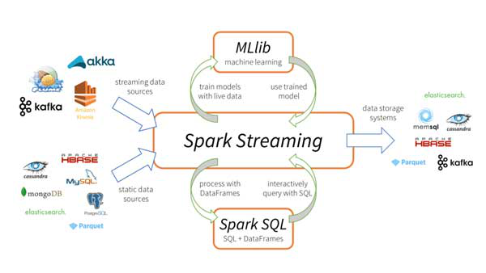

# Introduction

Today's systems are becoming more complex and data-intensive than ever before. The databases are getting bigger and bigger and become a challenge for applications, it will have problems with storage, processing time. More complex requirements such as statistics, reports or supporting user interactions on large amounts of data. To ensure fast application performance, in-time response allows for more advanced processing techniques. In this article we will give some solutions to help you find a solution to your problems

# Solution

As we know out side have a lot solution to do this but will depend on some constraint such as: price, time, infrastructure and others. In this article i will review the more recent solution and providing some use case

- Solution 1: From big database we will extra data and move it to many smaller tables we call cache table, we also create index and create partition for it to make query quicker. To create cache table quicker we use multiple thread
- Solution 2: From the beginner one database will lead the read performace so when database become bigger, we can consider to create slave database for read and backup
- Solution 3: With the data bigger every day, we need an process  like ETL, Hadoop ecosystem

## Solution 1: Cache table, partition and multithread processing

Indexing

### Optimize config database

### Optimize query

**ORM Query**

**Raw query**

- Do not use `SELECT *` if you do not need all the data in the queried tables.
- Write the appropriate query to avoid calling multiple queries for 1 processing logic (for, loop query)
- Split large queries into moderately sized queries (eg you can limit 10000 records at a time)
- Remove join, remove join in query instead join in application (avoid resource locking, more efficient caching, more efficient data distribution)
- Limited use of DISTINCT because it slows down the query

**Indexes**:

- If your database uses select operator more than insert and update operator

## Solution 2: Database architecture

For large systems, more and more data makes 1 database or 1 piece of hardware will not be able to serve many users or more and more data. To optimize the query and search for data, we have many techniques that can be applied to handle the above problem.

### Replication

For systems that serve many users with many different tasks such as reading, writing, updating data ... to optimize data reading we can install replica databases so that clients can optimize reading on database replicas and optimize data writing on database master while ensuring performance and data integrity for clients.

We talk about how replica works, when a client sends enough data to database A, databases B and C are 2 replicas will also read the corresponding changes to update. Database A can actively send information through B and C and wait for confirmation when it is called synchronous, it ensures the data on all servers is the same, but it takes an extra time to wait for data. synchronized and send the response back to the client. If there is a replica machine that does not respond, all data will be rolledback.

The second way is that the client sends data to server A and server A will respond to the successful result to the client immediately, then the changed data will be synchronized to database servers B and C. This option is asynchronous when the job copies data to other servers when network problems occur.

### Partitioning

For a large data table we can split that table according to some criteria into many smaller data tables based on some criteria such as subdividing a table by day, month or year, by region, by region. IP range. We can understand this is the process of dividing tables, indexes, views at a low level, each partition as smaller compartments.

This is a popular method in small and medium projects, it allows programmers to divide a large table of data into smaller intervals according to a criterion to speed up the query for a certain data range.

**Attention when creating partition:**

- Partition key is the column that frequently appears in the search condition
- The column has many different values but not too many
- The values in the column are evenly distributed
- Do not choose columns of type varchar whose data can be anything

**Chọn kiểu partition:**

- List partition: The table will be divided into partitions based on the values of the partition key column, these values are finite and discrete (discrete value).

```sql
CREATE TABLE sales_list(
    salesman_id NUMBER(5),
    salesman_name VARCHAR2(30),
    sales_state VARCHAR2(20),
    sales_amount NUMBER(10),
    sales_date DATE)
PARTITION BY LIST(sales_state)
(
    PARTITION sales_west VALUES ('California', 'Hawaii'),
    PARTITION sales_east VALUES ('New York', 'Virginia', 'Florida'),
    PARTITION sales_central VALUES ('Texas', 'Illinois'),
    PARTITION sales_other VALUES (DEFAULT)
);
```

- Range partition: The table will be divided into partitions based on the range of values of the partition key column.

```sql
create table order_details (
    order_id number,
    order_date date)
partition by range (order_date)(
    partition p_jan values less than (to_date('01-FEB-2022','DD-MON-YYYY')),
    partition p_feb values less than (to_date('01-MAR-2022','DD-MON-YYYY')),
    partition p_mar values less than (to_date('01-APR-2022','DD-MON-YYYY')),
    partition p_2009 values less than (MAXVALUE)
);
```

- ****Hash partition:**** Streams of data will be randomly distributed into partitions, using a hash value column partition key function. Every time new data is available, the hash value will be calculated and decide to which part the data should belong. With the Hash partition type, the partitions will have the same data

```sql
CREATE TABLE employees (
     empno NUMBER(4),
     ename VARCHAR2(30),
     sal NUMBER
)
PARTITION BY HASH (empno) (
     PARTITION h1 TABLESPACE t1,
     PARTITION h2 TABLESPACE t2,
     PARTITION h3 TABLESPACE t3,
     PARTITION h4 TABLESPACE t4
);
```

Partition theo row hay column

### Clustering

Clustering is a group of nodes that store the same database schema on the same database software with some form of data exchange between servers. From outside the cluster, servers are viewed as a single unit containing a data union that is spread across the nodes in the cluster. When a client accesses a cluster, the request is eventually routed to a single node for read and write.

This setting makes reading large amounts of data guaranteed to be safe.

**Advantage:**

Load balancing: Requests are distributed and moderated across nodes
- High availability
- Data redundancy: DB nodes are synchronized, in case there is a problem in one node, data can still be accessed at another node.
- Scalability: Easily upgrade, add equipment and fix problems.


**Disadvantage:**

- Operating costs

### **Sharding**

Split a large data table horizontally. A table containing 100 million rows can be divided into multiple tables containing 1 million rows each. Each table due to the split will be placed into a separate database/server. Sharding is done to distribute the load and improve the access speed. Facebook /Twitter is using this architecture.

Sharding will be suitable for super large data, it is a scalable database architecture, by splitting a larger table you can store new blocks of data called logical fragments. Sharding can achieve horizontal scalability and improve performance in a number of ways:

- parallel processing, leveraging computing resources on the cluster for every query
- Individual pieces are smaller than the entire logic table, each machine has to scan fewer rows when answering a query.

**Advantage:**

- Expand the database horizontally
- Speed up query response time
- Minimize the impact if there is 1 database down

**Disadvantage:**

- There is a risk of data loss or table corruption
- Complex in management and access
- Possible segmental imbalance

**Classification of sharding architectures:**

- Key based sharding
     - Use table keys to determine which shard to save data, Prevent data hot spots, no need to maintain a map of where data is stored
     - Difficulty adding new shards, data imbalance between shards
- Range base sharding
     - Based on the range of a value of a certain data column
     - Can be unevenly distributed leading to data hotspots
- Directory based sharding (List)
     - Need to create and maintain lookup table using segment key
     - Each key is tied to its own specific segment
- Vertical sharding
     - Split table into smaller table with different number of columns data
     - Small tables can be stored in different databases, different machine
- Horizontal sharding
     - Split into smaller table by the row of the table
     - Small tables can be stored in different databases, different machine

## [Database comparison](./database-system.md)

## More trending solutions for Big data

Input: We have a dataset of e-commerce with information about product, price, category … we need to process this data and generate a report with some criteria.

### **Props:**

Database:

Language:

### **Cons:**

### System diagram

### Implementation

## Compare

**Apache Spark**

Apache spark is designed to help process and analyze terabytes of data

Apache spark is a data processing framework that provides an interface for programming parallel computing clusters with fault tolerance. Advantages of distributed computing capabilities

The components:

- **Spark core**: core component, connecting other components. Calculation and processing in memory, and reference to data stored in external storage systems.
- **Spark Streaming**: is a plugin that helps Apache spark respond to real-time or near-real-time processing requests. Spark Streaming breaks down the processing stream into a continuous sequence of microbatches which can then be manipulated using the Apache Spark API. In this way, the code in the batch and streaming processes can be reused, run, and run. on the same framework, thus reducing costs for both developers and operators.



- **Spark SQL**: Spark SQL focuses on structured data processing, using a data frame approach borrowed from the R and Python languages (in Pandas). As the name suggests, Spark SQL also provides an interface with SQL syntax to query data, bringing the power of Apache Spark to data analysts and developers alike.
- **MLlib** (*****Machine Learning Library)**** : MLlib is a distributed machine learning platform on top of Spark with a distributed memory-based architecture. According to some comparisons, Spark MLlib is 9 times faster than the equivalent Hadoop library Apache Mahout.*
- **GraphX**: Spark GraphX comes with a selection of distributed algorithms for dealing with graph structure. These algorithms use Spark Core's RDD approach to data modeling; The GraphFrames package allows you to perform graph processing on data frames, including taking advantage of the Catalyst optimizer for graph queries.
Map reduce

**Hadoop ecosystem**

- Apache kafka
- Apache hadoop ⇒ Referral qua Brain.d.foundation.

# Conclusion