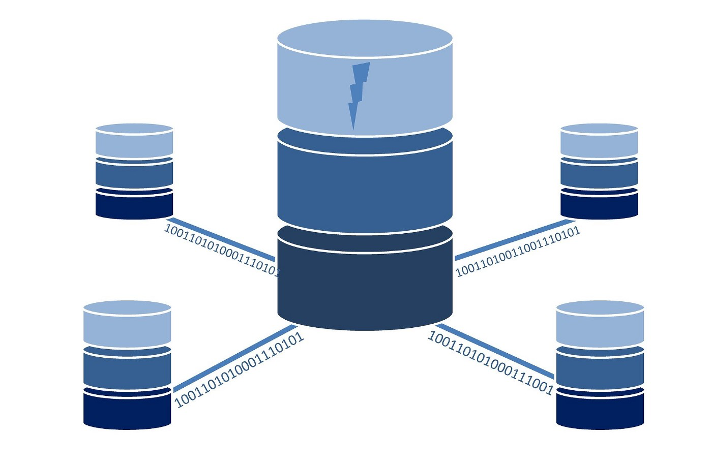
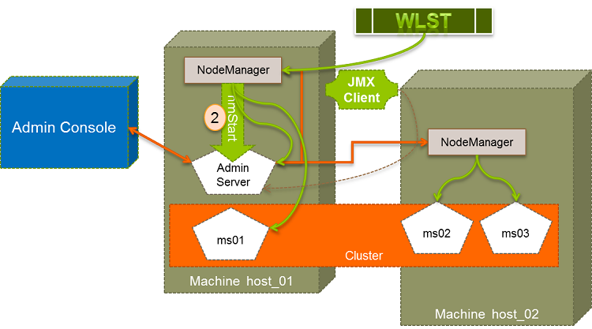

## Introduction

The increasing complexity and data-intensity of today's systems have created challenges for applications in managing large databases. With growing storage and processing needs, these databases can slow down applications and hinder their ability to deliver fast, in-time responses. Advanced processing techniques are needed to handle the growing demand for data statistics, reports, and user interactions. In this article, we will provide practical solutions to help overcome these challenges and improve application performance

## Problem

We have more than 500M records data and users can filter or sort randomly with multiple complex aggregation fields so making a regular query with a partition table and indexed fields won’t work. Timeout when querying big data with multiple complex aggregation fields.

## Solution

As we know out side have a lot solution to do this but will depend on some constraint such as: price, time, infrastructure and others. In this article i will review the more recent solution and providing some use case

- Level 1: From big database we will extra data and move it to many smaller tables we call cache table, we also create index and create partition for it to make query quicker. To create cache table quicker we use multiple thread
- Level 2: From the beginner one database will lead the read performance so when database become bigger, we can consider to create slave database for read and backup

Almost common database, solution level 1 can help us handle query speed

### Level 1: Cache table, partition and multithread processing

We can run parallel processes to build cached data row by row because queries with where clause and without order will be fast and we can run similar base server resources.

#### Detail

- When running aggregation in partition tables it will take a very long time to scan all tables
  ⇒ if we have a **WHERE** clause with a partition field it will help the system take some tables to query and reduce query time
- **ORDER BY** takes a long time because it has to wait for all aggregation fields done and then order it
  ⇒ skip order aggregation fields will reduce query time
- Making a query to do everything in our report is hopeless so we need to run parallel to get one-by-one independent row results and then return it async to the user

#### Solution build the cached table by getting row by row result

In normal way, we use `VIEW` or `MATERIALIZED VIEW` to cache the query but with large data we will have timeout or wait so long time to return all records result.

Query with **WHERE** clause with a partition field is fast but we have to wait query by query.

So if we can combine the speed from **WHERE** clause query and run multiple query at the same time then insert into one cached table, we can get result set faster and make use of application resources.

Example Elixir code for this

```elixir
def update_filtered_result_report(index_id, params) do
    entries = 1..99

    entries
    |> Task.async_stream(
      fn entry ->
        entry
        |> DemoTradeResultsService.get_summary_by_entry() ## This function will return list of records after group by
        |> Enum.chunk_every(1000)
        |> Enum.map(fn chunk ->
          create_all(index_id, chunk)
        end)

        Logger.info("Done entry #{entry} for filtered table #{index_id}")

        length(result)
      end,
      max_concurrency: 64,
      timeout: :infinity
    )
    |> Enum.reduce(0, fn {:ok, total}, acc -> total + acc end)

    Logger.info("Done to build cached filter table #{index_id}")
  end

  def get_summary_by_entry(entry) do
    default_query()
    |> where([t], t.entry == ^entry)
    |> Repo.all(timeout: :infinity)
  end

  def default_query() do
    from(d in DemoTradeResults,
      group_by: [d.entry, d.target, d.stoploss, d.rr],
      select: %{
        target: d.target,
        entry: d.entry,
        stoploss: d.stoploss,
        rr: d.rr,
        win_rate: fragment("cast(round(cast(cast(sum(win) * 100 as float) / cast(count(price_structure_id) as float) as numeric), 2) as float)"),
        lose_rate: fragment("cast(round(cast(cast(sum(lose) * 100 as float) / cast(count(price_structure_id) as float) as numeric), 2) as float)"),
        na_rate: fragment("cast(round(cast(cast(sum(na) * 100 as float) / cast(count(price_structure_id) as float) as numeric), 2) as float)"),
        win_count: sum(d.win),
        lose_count: sum(d.lose),
        na_count: sum(d.na),
        price_structure_count: count(d.price_structure_id),
      }
    )
  end
```

**Pure SQL**

```sql
SELECT
  target,
  entry,
  stoploss,
  rr,
  cast(round(cast(cast(sum(win) * 100 as float) / cast(count(price_structure_id) as float) as numeric), 2) as float) AS win_rate,
  cast(round(cast(cast(sum(lose) * 100 as float) / cast(count(price_structure_id) as float) as numeric), 2) as float) AS lose_rate,
  cast(round(cast(cast(sum(na) * 100 as float) / cast(count(price_structure_id) as float) as numeric), 2) as float) AS na_rate,
  sum(win) AS win_count,
  sum(lose) AS lose_count,
  sum(na) AS na_count,
  count(price_structure_id) AS price_structure_count
FROM
  backtest_trade_results
WHERE
	entry = 1, target = 0, stoploss = 99
GROUP BY
  entry,
  target,
  stoploss,
  rr
```

**How to build fully cached table data**

- We need to define a list of values in WHERE CLAUSE so we can save time to get it when running the query
  - Can define a static list in code if it’s static
  - Can get distinct data from the table and cached it somewhere
- In this example, WHERE CLAUSE contains `entry`, `target`, `stoploss` so we need to define these lists.
  - `entry`: [1..99]
  - `target`: [0..98]
  - `stoploss`: [1..100]
- After defining list to run all rows we can run a loop and run it parallel to fill up the cached table

Return data while building cached table and it takes a long time to build

What if the user queries new filter data and we haven’t had a cached table for this, how can we return exact data to a user in an acceptable time?

- We need to define the data event and can build ASAP after receiving new data to update cached tables which are used regularly. In this example, we have to rebuild cached table for all price structures
- We need to order values in the `WHERE CLAUSE` list base on the order by and where clause from the user filter and then run multiple processes to get paginated data. For example based on the requirement `Get all entries to have win rate from **60%** to **80%** from backtest result table (table has more than 500M records) and order by rr (reward & risk) desc` We need to analyze to define the order value in this query

#### Optimize database query

- Do not use `SELECT *` if you do not need all the data in the queried tables.
- Write the appropriate query to avoid calling multiple queries for 1 processing logic (for, loop query)
- Split large queries into moderately sized queries (eg you can limit 10000 records at a time)
- Remove join, remove join in query instead join in application (avoid resource locking, more efficient caching, more efficient data distribution)
- Limited use of DISTINCT because it slows down the query
- Use pagination: If you need to retrieve only a portion of the data, use pagination to limit the amount of data returned in each query.
- Use appropriate aggregate functions: Use aggregate functions such as SUM, AVG, MIN, and MAX judiciously, as they can slow down the performance of large queries.

You can test with the real database:

Before optimize database and query

```
SELECT
 miner_name,
  MAX(fan_percentage)
FROM miner_data
WHERE miner_name IN
  (SELECT DISTINCT "name"
   FROM miners)
GROUP BY 1
ORDER BY 1;
 miner_name |        max
------------+-------------------
 Bronze     |  94.9998652175735
 Default    | 94.99994839358486
 Diamond    | 94.99999006095052
 Gold       |  94.9998083591985
 Platinum   | 94.99982552531682
 Silver     | 94.99996029210493
Time: 9173.750 ms (00:09.174)
```

Optimize:

```
SELECT
  DISTINCT ON (miner_name) miner_name,
  MAX(fan_percentage)
FROM miner_data
GROUP BY miner_name;
miner_name |        max
------------+-------------------
 Bronze     |  94.9998652175735
 Default    | 94.99994839358486
 Diamond    | 94.99999006095052
 Gold       |  94.9998083591985
 Platinum   | 94.99982552531682
 Silver     | 94.99996029210493
Time: 2794.690 ms (00:02.795)
```

Before optimize database and query

By writing query in a smarter way, we saved ourselves time.

Pre-optimization: 9173.750 ms

Post-optimization: 2794.690 m

#### Optimize index

Index is a data structure, stored according to a specialized mechanism to find records quickly. There are many different types of indexes such as hash index, b-tree index ... and in a table can create indexes for multiple columns. However, it's disadvantage will be increased time when write or update as well as complicate data management and storage space. Some notes when creating indexes:

- Create index for primary key data
- Only index frequently used columns in ```WHERE```, ```ORDER BY``` clauses
- Do not create index for columns with too many duplicate values, null
- Using multiple columns in an index, it is necessary to pay attention to the order of columns.
- Index does not work for operators ```<>``` ```(!=)``` or ```NOT IN```
- Avoid using subqueries: Subqueries can be slow and difficult to optimize, try to find an alternative solution using JOINs or temporary tables.

Create index for single column

```CREATE UNIQUE INDEX index_name ON table_name (column_list);```

Create index for multiple columns

```sql
CREATE TABLE wallets (
    id int not null AUTO_INCREMENT, primary key (id),
    user_id int(10) unsigned NOT NULL,
    bank_id int(10) unsigned NOT NULL,
    account_id int(10) unsigned NOT NULL,
    amount int(11) NOT NULL DEFAULT 0,
    created_at timestamp NOT NULL DEFAULT CURRENT_TIMESTAMP,
    updated_at timestamp NOT NULL DEFAULT CURRENT_TIMESTAMP
    UNIQUE INDEX multiple_index (user_id, bank_id, account_id)
)
```

#### Investigate query WHERE IN vs JOIN

The original query:

```SQL
SELECT
      r.entry,
      r.target,
      r.rr,
      r.custom_rr,
      SUM ( r.win ) AS win_count,
      SUM ( r.lose ) AS lose_count,
      SUM ( r.na ) AS na_count,
      COUNT ( r.price_structure_id ) AS price_structure_count,
      cast(round(cast(sum(realized_pnl) as numeric), 2) as float) as realized_pnl
  FROM
      demo_trade_results_range r 
  WHERE
      r.entry = 1 
      AND r.price_structure_id IN (?,?,....)
  GROUP BY
      r.entry, r.target, r.stoploss, r.rr, r.custom_rr;
```

Currently, we used WHERE IN in our query, we concerned that it will be slow because we have a lot of price_structure_id in the IN clause. So we decided to change it to JOIN instead of WHERE IN. And do some benchmark to see the difference between them.

```SQL
SELECT
    r.entry,
    r.target,
    r.rr,
    r.custom_rr,
    SUM ( r.win ) AS win_count,
    SUM ( r.lose ) AS lose_count,
    SUM ( r.na ) AS na_count,
    COUNT ( r.price_structure_id ) AS price_structure_count,
    cast(round(cast(sum(realized_pnl) as numeric), 2) as float) as realized_pnl
FROM
    demo_trade_results_range r 
    INNER JOIN price_structures ps ON r.price_structure_id = ps.id
WHERE
    r.entry = 1
    -- Some other conditions
GROUP BY
    r.entry, r.target, r.stoploss, r.rr, r.custom_rr;
```

With WHERE IN case clause, we created a script to execute the query with different price_structure_id in the IN clause. Each case, run 1000 time and get the average. And we got the result:

WHERE IN result:
| Price structure count |   200   |   1000  |  2000   |  3000   |  5000   |
|-----------------------|---------|---------|---------|---------|---------|
| Execution time (ms)   | 82.678  | 119.488 | 375.951 | 644.932 | 902.126 |

JOIN result:
| Price structure count |   390   |   4246  |  9661   |
|-----------------------|---------|---------|---------|
| Execution time (ms)   | 189.859 | 356.08  | 570.079 |

We can see that the execution time is increasing when the number of price_structure_id is increasing. But the JOIN case is not increasing as fast as the WHERE IN case.

So, we could see that depend on the number of parameters, we could use WHERE IN or JOIN to get the best performance. With low number of parameters, we could use WHERE IN, and with high number of parameters, we could use JOIN.

#### Optimize Partition

#### Database tuning

SQL query which we execute, has to load the data into memory to perform any operation. It has to hold the data in memory, till the execution completes.

If the memory is full, data will be spilled to disk which causes the transactions to run slow, because disk I/O is time taking task.

So, a good amount of memory enough to fit the data that is being processes as part of SQL is needed.

So you need increase server resource as much as you can base on your scale and acceptable cost to prevent out of memory or out of CPU utilization and increase query process speed

We suggest to check the benchmark chart and config to your database server to make sure `CPU utilization` and `Memory usage` are under 70%, so it will make query speed is stable

### Level 2: Database architecture

For large systems, more and more data makes 1 database or 1 piece of hardware will not be able to serve many users or more and more data. To optimize the query and search for data, we have many techniques that can be applied to handle the above problem.

#### Replication

For systems that serve many users with many different tasks such as reading, writing, updating data ... to optimize data reading we can install replica databases so that clients can optimize reading on database replicas and optimize data writing on database master while ensuring performance and data integrity for clients.

We talk about how replica works, when a client sends enough data to database A, databases B and C are 2 replicas will also read the corresponding changes to update. Database A can actively send information through B and C and wait for confirmation when it is called synchronous, it ensures the data on all servers is the same, but it takes an extra time to wait for data. synchronized and send the response back to the client. If there is a replica machine that does not respond, all data will be rolled back.

The second way is that the client sends data to server A and server A will respond to the successful result to the client immediately, then the changed data will be synchronized to database servers B and C. This option is asynchronous when the job copies data to other servers when network problems occur.

#### Partitioning

For a large data table we can split that table according to some criteria into many smaller data tables based on some criteria such as subdividing a table by day, month or year, by region, by region. IP range. We can understand this is the process of dividing tables, indexes, views at a low level, each partition as smaller compartments.

This is a popular method in small and medium projects, it allows programmers to divide a large table of data into smaller intervals according to a criterion to speed up the query for a certain data range.

**Attention when creating partition:**

- Partition key is the column that frequently appears in the search condition
- The column has many different values but not too many
- The values in the column are evenly distributed
- Do not choose columns of type varchar whose data can be anything

**Select partition type:**

- List partition: The table will be divided into partitions based on the values of the partition key column, these values are finite and discrete (discrete value).

```sql
CREATE TABLE sales_list(
    salesman_id NUMBER(5),
    salesman_name VARCHAR2(30),
    sales_state VARCHAR2(20),
    sales_amount NUMBER(10),
    sales_date DATE)
PARTITION BY LIST(sales_state)
(
    PARTITION sales_west VALUES ('California', 'Hawaii'),
    PARTITION sales_east VALUES ('New York', 'Virginia', 'Florida'),
    PARTITION sales_central VALUES ('Texas', 'Illinois'),
    PARTITION sales_other VALUES (DEFAULT)
);
```

- Range partition: The table will be divided into partitions based on the range of values of the partition key column.

```sql
create table order_details (
    order_id number,
    order_date date)
partition by range (order_date)(
    partition p_jan values less than (to_date('01-FEB-2022','DD-MON-YYYY')),
    partition p_feb values less than (to_date('01-MAR-2022','DD-MON-YYYY')),
    partition p_mar values less than (to_date('01-APR-2022','DD-MON-YYYY')),
    partition p_2009 values less than (MAXVALUE)
);
```

- \***\*Hash partition:\*\*** Streams of data will be randomly distributed into partitions, using a hash value column partition key function. Every time new data is available, the hash value will be calculated and decide to which part the data should belong. With the Hash partition type, the partitions will have the same data

```sql
CREATE TABLE employees (
     empno NUMBER(4),
     ename VARCHAR2(30),
     sal NUMBER
)
PARTITION BY HASH (empno) (
     PARTITION h1 TABLESPACE t1,
     PARTITION h2 TABLESPACE t2,
     PARTITION h3 TABLESPACE t3,
     PARTITION h4 TABLESPACE t4
);
```

#### Clustering

Clustering is a group of nodes that store the same database schema on the same database software with some form of data exchange between servers. From outside the cluster, servers are viewed as a single unit containing a data union that is spread across the nodes in the cluster. When a client accesses a cluster, the request is eventually routed to a single node for read and write.

This setting makes reading large amounts of data guaranteed to be safe.

**Advantage:**

Load balancing: Requests are distributed and moderated across nodes

- High availability
- Data redundancy: DB nodes are synchronized, in case there is a problem in one node, data can still be accessed at another node.
- Scalability: Easily upgrade, add equipment and fix problems.



**Disadvantage:**

- Operating costs

#### **Sharding**

Split a large data table horizontally. A table containing 100 million rows can be divided into multiple tables containing 1 million rows each. Each table due to the split will be placed into a separate database/server. Sharding is done to distribute the load and improve the access speed. Facebook /Twitter is using this architecture.

Sharding will be suitable for super large data, it is a scalable database architecture, by splitting a larger table you can store new blocks of data called logical fragments. Sharding can achieve horizontal scalability and improve performance in a number of ways:

- parallel processing, leveraging computing resources on the cluster for every query
- Individual pieces are smaller than the entire logic table, each machine has to scan fewer rows when answering a query.

**Advantage:**

- Expand the database horizontally
- Speed up query response time
- Minimize the impact if there is 1 database down

**Disadvantage:**

- There is a risk of data loss or table corruption
- Complex in management and access
- Possible segmental imbalance

**Classification of sharding architectures:**

- Key based sharding
  - Use table keys to determine which shard to save data, Prevent data hot spots, no need to maintain a map of where data is stored
  - Difficulty adding new shards, data imbalance between shards
- Range base sharding
  - Based on the range of a value of a certain data column
  - Can be unevenly distributed leading to data hotspots
- Directory based sharding (List)
  - Need to create and maintain lookup table using segment key
  - Each key is tied to its own specific segment
- Vertical sharding
  - Split table into smaller table with different number of columns data
  - Small tables can be stored in different databases, different machine
- Horizontal sharding
  - Split into smaller table by the row of the table
  - Small tables can be stored in different databases, different machine

## Conclusion

Although these are basic optimization techniques, they can yield significant results. While they may be straightforward in concept, implementation may not always be straightforward. You can achieve some of the following result:

- Know how to optimize query command
- Create a sufficient and valid number of database indexes without creating huge amounts of data on disk — thereby perhaps doing a counter effect and encouraging the database to search in the wrong way
- Create partition for one or multiple column for optimize query time.
- Apply sharding or clustering to optimize high availability and performance.

If in your project have applied the above techniques and still have not solved the problem, then you can learn some more supporting technologies to handle big data such as Apache Spark. We will have a mining development guide for Apache Spark in the near future.

## Reference
- [Database comparison](./database-system.md)
- [Apache Kafka](https://en.wikipedia.org/wiki/Apache_Kafka)
- [Apache Hadoop](https://brain.d.foundation/Engineering/Data/Hadoop+Distributed+File+System+(HDFS))
- [Apache Hive](https://brain.d.foundation/Engineering/Data/Introduction+to+Apache+Hive)
- [Database sharding](https://aws.amazon.com/what-is/database-sharding/)
- [Understanding Database Sharding](https://www.digitalocean.com/community/tutorials/understanding-database-sharding)
- [Comparing Database Management Systems](https://www.altexsoft.com/blog/business/comparing-database-management-systems-mysql-postgresql-mssql-server-mongodb-elasticsearch-and-others/)
- [Which Modern Database Is Right for Your Use Case?](https://www.integrate.io/blog/which-database/)
